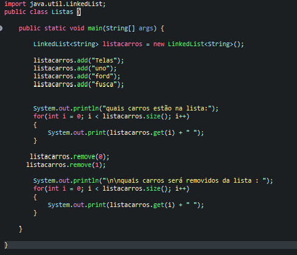

## Java Collections 
 Nas primeiras versões de java já eram disponiveis estruturas de arrays e as classes ``Vector`` e ``Hashtable``. No entanto, além da dificuldade em implementar estruturas de dados utilizando arrays,  também sentiam-se falta de classes que implementassem estruturas como listas ligadas e tabelas de espalhamento (hash). Para atender a essas necessidades, só apartir do Java 1.2 que foi criado um conjunto de interfaces e classes dada como Collections Framework que e utilizado atraves do pacote **java.util.list** .

## List
*A interface List é uma coleção do tipo lista, em que os elementos em uma lista são ordenados como uma sequência. O usuário pode utilizar o número do índice para acessar um determinado elemento da lista*                                                                                                             
 Na hierarquia do Java Collections o ``List`` é uma interface implementada na classes _ArrayList_, _LinkedList_ e na _Vector_ que também é extendida da classe _Stack_ .
 

### Tipos de List
- ArrayList

A ArrayList é uma classe que implementa a interface ``List`` , esta classe tem seus objetos arrays dinâmicos. O ArrayList implementa todos os métodos List e permite todos elementos até mesmo os nulos. Os objetos desta classe têm uma capacidade, que inicialmente igual ao tamanho, mas aumenta à medida que novos elementos são adicionados, ela não está sincronizado então varias unidades de controle de fluxo sequencial pode ser processada no sistema operacional.

**Metodos utéis**
- Método add – Adiciona um elemento no final do ArrayList.
- Método clear – Remove todos os elementos da estrutura.
- Método contains – Verifica se o ArrayList contém um elemento especificado, e retorna true em caso positivo, ou false caso contrário.- 
- Método get – Retorna o item em uma posição de índice especificada.
- Método indexOf – Retorna a posição de índice da primeira ocorrência de um elemento especificado.
- Método remove – Remove a primeira ocorrência de um valor especificado ou de um elemento em um índice.
- Método size – Informa o número de elementos que estão armazenados na estrutura.
- Método trimToSize – Ajusta a capacidade do ArrayList de acordo com o número de elementos armazenados no momento.

**Exemplo** 

**Resultado**

``Mostrar o conteúdo do ArrayList usando laço for convencional:tenis Camisa``

``Mostrando a lista de compras com o método mostrar: tenis Camisa``

``Nova visualização da lista após adicionar nas compras: tenis Camisa Sandalia Chinelo``

``Nova visualização da lista após remover frutas: Camisa Sandalia Chinelo``

``Remover o segundo elemento da lista (índice 1): Camisa Chinelo``

``Tamanho atual do ArrayList: 2 itens
O item "Sandalia" não está na lista``

- LinkedList

Ao contrário do ``ArrayList`` as buscas desta classe é linear e inserçóes e exclusões são rápidas. Já que implementa uma lista ligada, cada nó tem o seu dado e uma referência para o próximo nó. LinkedList é muito usada aplicações para exibir grande quantidade de inserções e exclusões.

**Exemplo**

**Resultado**

``Qual carro está na lista:
Telas uno ford fusca``

``Qual carro será removido da lista : 
uno fusca``

